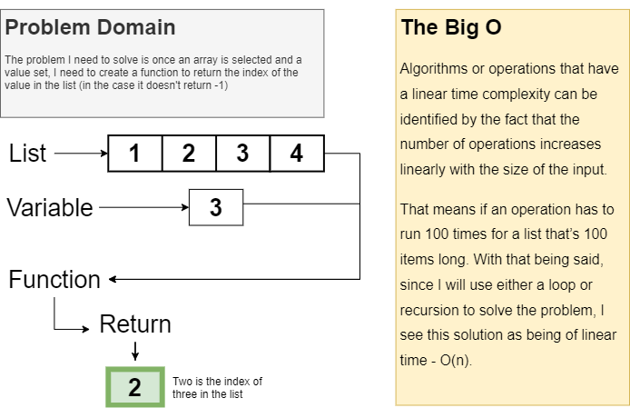

# Binary Search

Using Binary Search to find a value in a list.

## Challenge

Create a function that will receive a list and a value, then search  the list for that value. The function should return the index of the value in the list, if it exists in that list, if it isn't in the list it would return -1.

## Approach & Efficiency

I used a while loop to iterate through the list to check the middle value. I believe this approach qualifies as a O(n) since the number of iterations would be directly proportional to the length of the list.

## Solution

