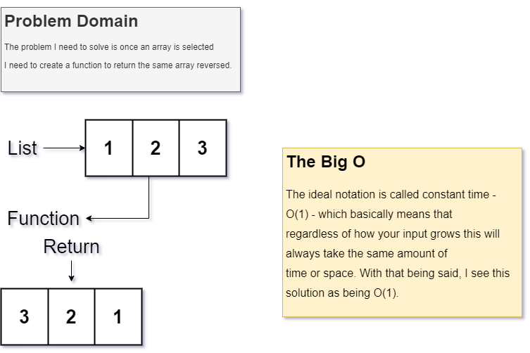

# Reverse an Array

Reverse the order of an inputted array.

## Challenge

Create a function that will receive a list as a parameter, reverse the order fo the list and then return the amended list.

## Approach & Efficiency

I used a slice method to solve this issue. I believe this qualifies as a O(1).

## Solution

