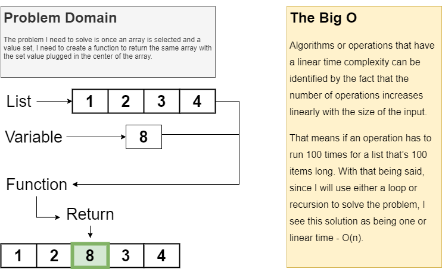

# Shift Array

Inserting values to an array.

## Challenge

Create a function that will receive a list and a value to add to the list as parameters. The function should add the value to the centre of the array then return the amended array.

## Approach & Efficiency

I used a loop to iterate through the list and while doing so adding the set value at the middle index. I believe this approach qualifies as a O(n).

## Solution

