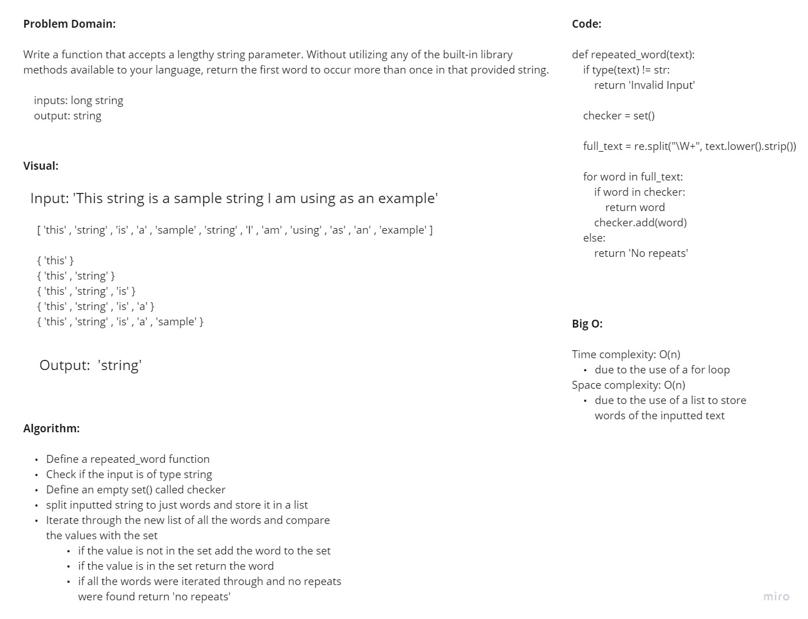

# Repeated Word

## Challenge Description

**Code Challenge 31:**

- Write a function that accepts a lengthy string parameter.
- Without utilizing any of the built-in library methods available to your language, return the first word to occur more than once in that provided string.

## Approach & Efficiency

Used a for loop, set() and regex to split the text and then search through it to solve the problem

## Whiteboard

