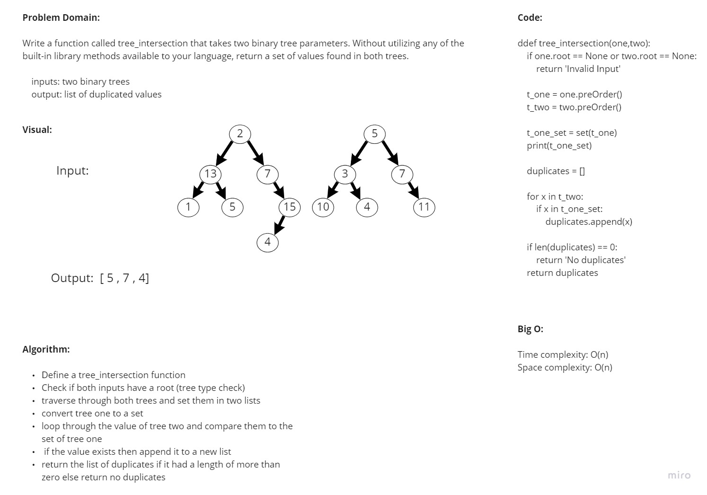

# Tree Intersection

## Challenge

**Code Challenge 32:**

- Write a function called tree_intersection that takes two binary tree parameters.
- Without utilizing any of the built-in library methods available to your language, return a set of values found in both trees.

## Approach & Efficiency

I used recursion and iteration to create and search in the tree.

## White Board

